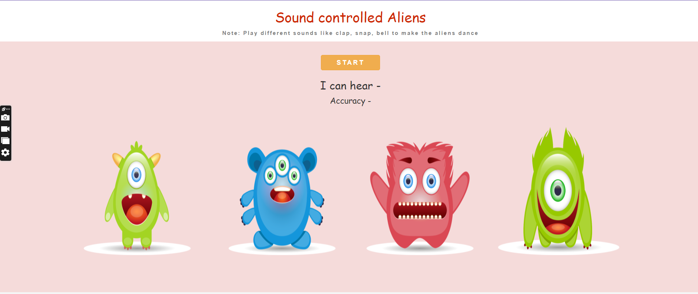

# Sound Controlled Aliens

# Project Description
- Sound Controlled Aliens is a fun and interactive web-based project that uses machine learning to recognize different sounds like claps, snaps, and bells. Aliens on the screen react to these sounds by dancing in real time, creating an engaging and playful experience.

## Demo

[Live Demo](https://shikha246.github.io/Sound-Control-Web-App/)

## Features
- Real-time sound recognition using machine learning
- Interactive aliens that react based on sounds
- Frontend created with HTML, CSS, and JavaScript
- Fun visual feedback for users

## Technologies Used
- **Frontend**: HTML, CSS, JavaScript
- **Machine Learning**: Google Teachable Machine

## Model Training

The sound classification model was trained using [Google’s Teachable Machine](https://teachablemachine.withgoogle.com/) with datasets of clap, snap, and bell sounds. The trained model was exported and integrated into the frontend for real-time sound recognition.
